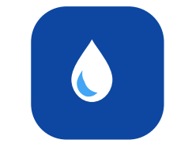
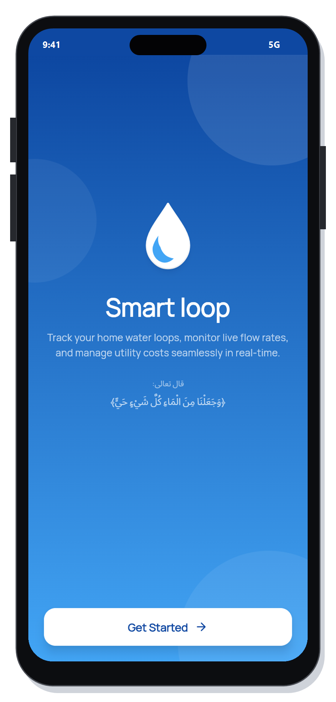
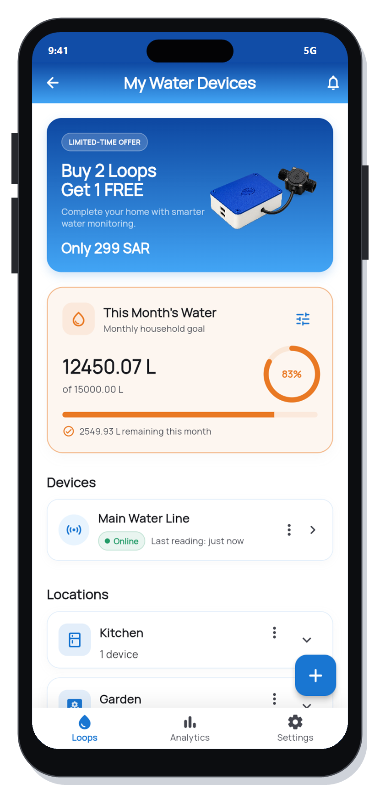
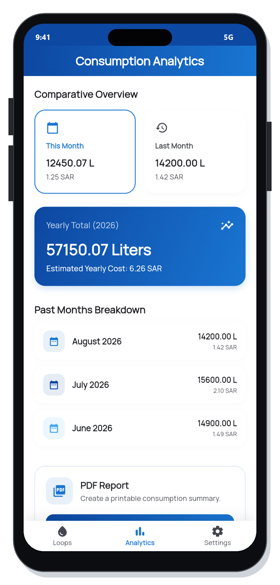
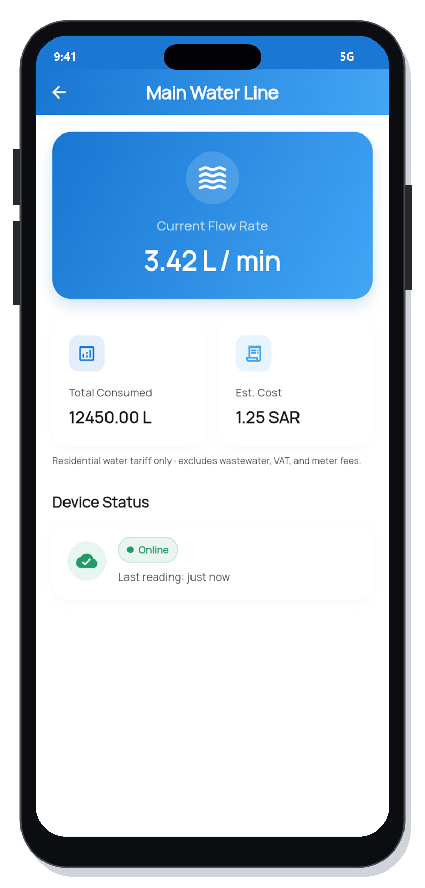
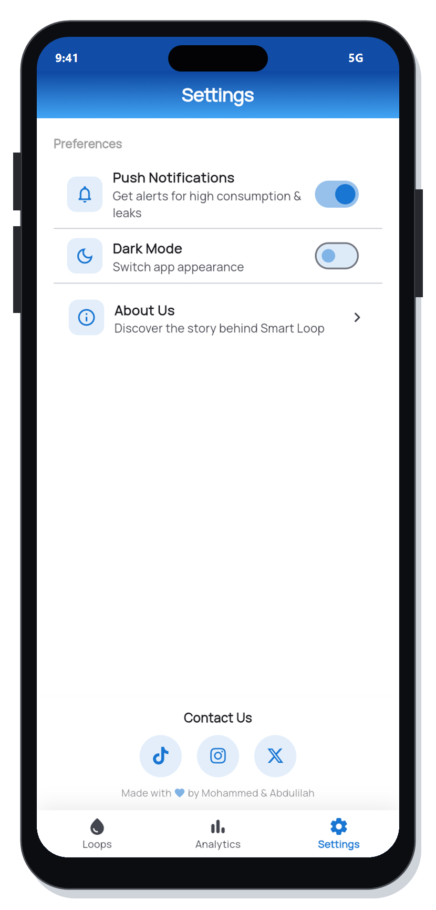
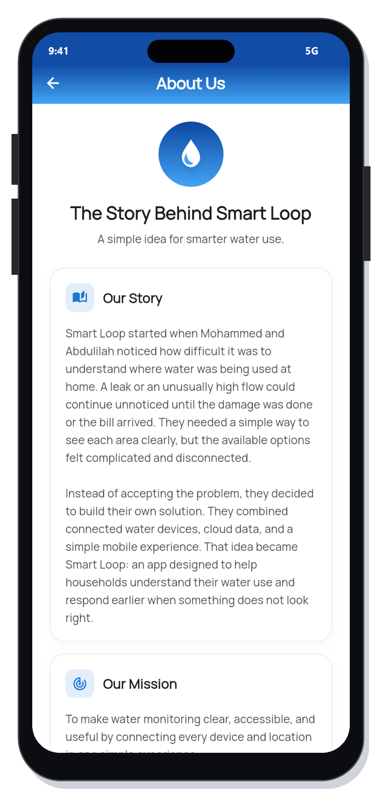
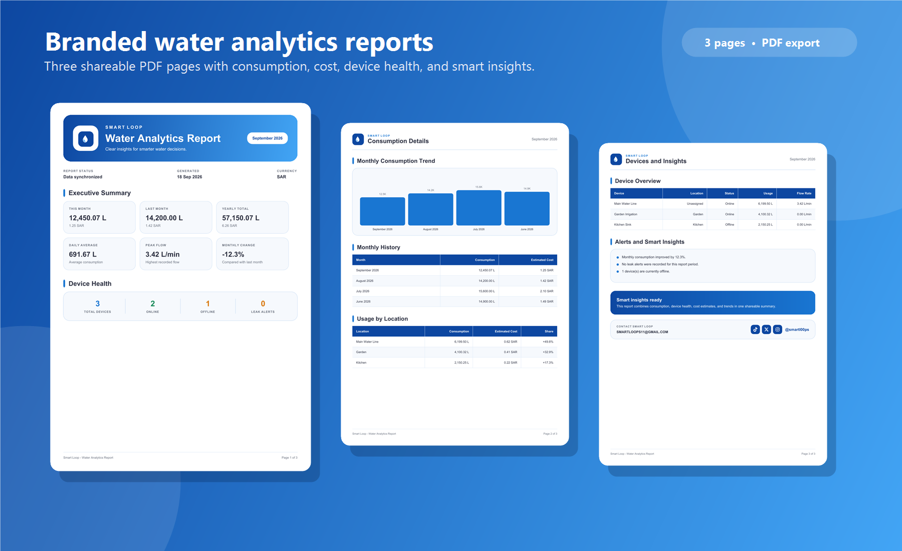
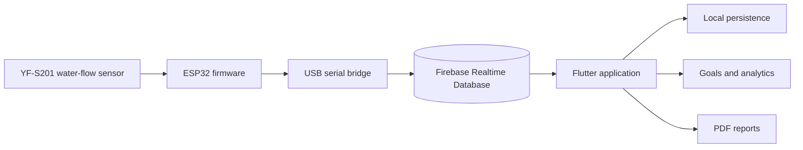

<div align="center">
  
  <h1>Smart Loop</h1>
  <p><strong>Smart water. Clear decisions.</strong></p>
  <p>A connected water-monitoring experience that turns live flow readings into useful insights, goals, cost estimates, and shareable reports.</p>

  <p>
    
    
    
    
    
  </p>
</div>

<table>
  <tr>
    <td align="center"></td>
    <td align="center"></td>
    <td align="center"></td>
  </tr>
</table>

## About Smart Loop

Smart Loop combines a water-flow sensor, an ESP32 controller, Firebase, and a polished Flutter application. It gives households a clear view of where water is being used, how much it may cost, and whether every connected device is online.

Mohammed and Abdulilah created Smart Loop after noticing that leaks and unusually high water flow can remain invisible until damage is done or the bill arrives. Their solution brings devices, locations, live readings, goals, analytics, and reporting into one simple experience.

## Key features

| Capability | What it delivers |
| --- | --- |
| Live monitoring | Current flow rate, total litres, latest reading, and online/offline status |
| Device organisation | Group devices by location such as kitchens, bathrooms, gardens, or floors |
| Water goals | Daily or monthly targets based on litres or estimated cost |
| Smart feedback | Clear progress states and colour changes as usage approaches the selected limit |
| Consumption analytics | Current month, previous month, yearly totals, and monthly breakdowns |
| Saudi cost estimates | Residential water-cost estimates shown beside consumption values |
| Offline-friendly state | Devices, goals, totals, and history remain available through local persistence |
| PDF reporting | A branded three-page report with usage, cost, device health, and insights |
| Personalisation | Notifications, light/dark appearance, About Us, and direct social links |

## App experience

<table>
  <tr>
    <td align="center">
      <strong>Home & goals</strong><br />
      
    </td>
    <td align="center">
      <strong>Live device details</strong><br />
      
    </td>
    <td align="center">
      <strong>Consumption analytics</strong><br />
      
    </td>
  </tr>
  <tr>
    <td align="center">
      <strong>Welcome</strong><br />
      
    </td>
    <td align="center">
      <strong>Settings</strong><br />
      
    </td>
    <td align="center">
      <strong>Our story</strong><br />
      
    </td>
  </tr>
</table>

## Branded PDF reports

Smart Loop can export a professional three-page water analytics report. It includes an executive summary, monthly consumption and cost history, usage by location, device health, flow readings, and automatically generated insights.

<p align="center">
  
</p>

A populated sample is available at [`output/pdf/smart_loop_report_preview.pdf`](output/pdf/smart_loop_report_preview.pdf).

## How it works



The sensor produces pulses as water moves through it. The ESP32 reads those pulses, calculates flow and total consumption, and sends the readings through the bridge to Firebase. Smart Loop then presents the latest data while preserving the user’s devices, locations, goals, and history locally.

## Technology

- **Flutter and Dart** for the responsive application and shared business logic.
- **Firebase Realtime Database** for live device readings and connection state.
- **ESP32** for the connected sensor controller.
- **YF-S201** for pulse-based water-flow measurement.
- **PlatformIO** for reproducible firmware builds and USB uploads.
- **Shared Preferences** for durable local application state.
- **Dart PDF and Printing** for branded report generation and sharing.

## Project structure

```text
lib/
  core/          App state, Firebase polling, persistence, and design constants
  models/        Devices, locations, goals, and analytics report models
  screens/       Welcome, Home, Analytics, Settings, About, and device dashboard
  services/      PDF report generation and application services
  widgets/       Reusable cards, status badges, banners, charts, and app bars
assets/images/   Smart Loop identity and product artwork
firmware/esp32/  ESP32 firmware and PlatformIO configuration
tool/            Serial bridge and PDF preview utilities
docs/            App screenshots, iPhone mockups, and README visuals
output/pdf/      Generated Smart Loop report preview
```

## Run the application

### Requirements

- Flutter SDK 3.x
- Dart 3.x
- Chrome, Android Studio, or a connected iOS/Android device
- A Firebase project when live cloud readings are required

```bash
flutter pub get
flutter run
```

Create a release build with:

```bash
flutter build apk --release
# or
flutter build web --release
```

## Connect an ESP32

1. Open `firmware/esp32` with PlatformIO in Visual Studio Code.
2. Verify the board, flow-sensor GPIO, status LED, and switch pins in `src/main.cpp`.
3. Configure Wi-Fi and Firebase values for the target environment.
4. Connect the ESP32 over USB and upload the firmware.
5. Run the serial-to-Firebase bridge from `tool/` when using the current demo workflow.
6. Open Smart Loop and confirm the device status changes to **Online** and live flow updates.

> Never commit Wi-Fi passwords, Firebase secrets, or service-account keys. Use private local configuration for credentials.

## Generate the PDF preview

```bash
dart run tool/generate_report_preview.dart
```

The generated report is written to `output/pdf/smart_loop_report_preview.pdf`.

## Roadmap

- Secure user authentication and device ownership.
- Wireless ESP32-to-Firebase publishing without the USB bridge.
- Sensor-specific calibration profiles for improved accuracy.
- Leak-pattern detection and push notifications.
- Multi-home support and richer data export options.

## Team & contact

Built with care by **Mohammed & Abdulilah**.

- Instagram: [@smartl00ps](https://www.instagram.com/smartl00ps?stkn=b3hvdmNvNjA3bzd0&utm_source=qr)
- TikTok: [@smartl00ps](https://www.tiktok.com/@smartl00ps?_r=1&_t=ZS-99fzwOI5YdM)
- X: [@smartl00ps](https://x.com/smartl00ps?s=11)
- Email: [SMARTLOOPS11@GMAIL.COM](mailto:SMARTLOOPS11@gmail.com)

---

<div align="center">
  <strong>Every drop matters.</strong>
</div>